# Semantic Analytics Platform — Enterprise Architecture Document

**Project:** Conversational Data Query Platform for Banking  
**Version:** 2.0  
**Date:** May 2026  
**Deployment:** Google Cloud Platform — Private VPN Access  

---

## Table of Contents

1. [Layered System Architecture](#1-layered-system-architecture)
2. [Multi-Tenancy Model](#2-multi-tenancy-model)
3. [Table-Level RBAC](#3-table-level-rbac)
4. [Data Source Model](#4-data-source-model)
5. [Data Source Onboarding Flow](#5-data-source-onboarding-flow)
6. [Query Execution Pipeline](#6-query-execution-pipeline)
7. [Security and Network Architecture](#7-security-and-network-architecture)
8. [GKE Deployment Layout](#8-gke-deployment-layout)
9. [Technology Stack](#9-technology-stack)
10. [Phased Delivery Roadmap](#10-phased-delivery-roadmap)

---

## 1. Layered System Architecture

The platform is organized into **six horizontal layers**, each with a clear responsibility. This separation ensures that teams can develop, test, and scale each layer independently.

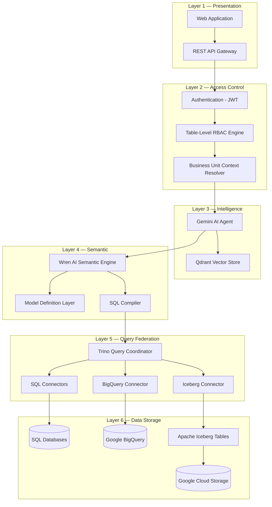

| Layer | Responsibility | Key Tech |
|-------|---------------|----------|
| **Presentation** | User-facing UI and API gateway | React/Next.js, FastAPI |
| **Access Control** | Auth, BU context resolution, table-level RBAC enforcement | JWT, Custom RBAC engine |
| **Intelligence** | NL understanding, context retrieval, tool orchestration | Gemini via Vertex AI, Qdrant |
| **Semantic** | Business-friendly data modeling, SQL compilation | Wren AI Engine, MDL |
| **Query Federation** | Route queries to the correct data source, join results | Trino |
| **Data Storage** | SQL, warehouse, and lakehouse data | Cloud SQL, BigQuery, Iceberg on GCS |

---

## 2. Multi-Tenancy Model

The platform uses a **two-tier hierarchy**: Bank (Organization) → Business Units (Tenants). Each Business Unit operates as an isolated tenant with its own users, data sources, and semantic models.

### 2A. Tenant Hierarchy

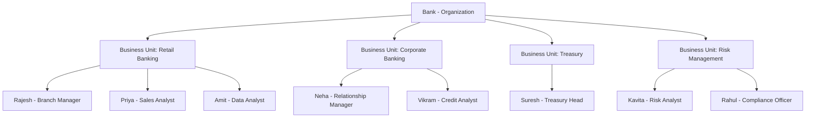

### 2B. What Each Business Unit Gets

Each Business Unit is a fully isolated tenant with its own:

| Resource | Isolation Level | Description |
|----------|----------------|-------------|
| **Users** | Per BU | Users belong to one or more BUs |
| **Data Sources** | Per BU, can be shared | A BU can connect to BigQuery, Iceberg, or SQL DBs |
| **Semantic Models** | Per BU | Each BU has its own Wren MDL models |
| **RBAC Policies** | Per BU | Table access is controlled per user within each BU |
| **Query History** | Per BU | Audit logs and cached queries are BU-scoped |
| **Qdrant Collection** | Per BU | Vector embeddings are stored in BU-specific collections |

---

## 3. Table-Level RBAC

Within a Business Unit, **different users can access different tables**. The RBAC engine filters the semantic model before it reaches the AI Agent, so the LLM never even sees tables a user is not authorized to query.

### 3A. RBAC Enforcement Model

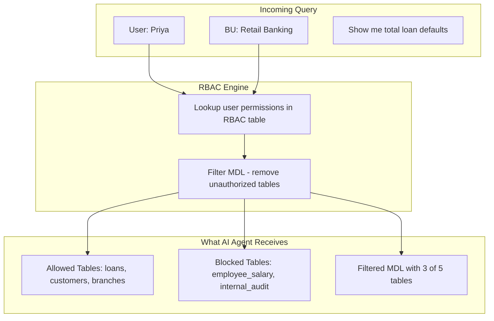

### 3B. RBAC Data Model

The access control is stored in a simple, auditable permissions table:

```
Table: table_permissions
----------------------------------------------
| user_id  | tenant_id           | table_name       | access |
|----------|-----------------|------------------|--------|
| priya    | retail_banking  | loans            | READ   |
| priya    | retail_banking  | customers        | READ   |
| priya    | retail_banking  | branches         | READ   |
| priya    | retail_banking  | employee_salary  | DENY   |
| amit     | retail_banking  | loans            | READ   |
| amit     | retail_banking  | customers        | READ   |
| amit     | retail_banking  | employee_salary  | READ   |
| amit     | retail_banking  | internal_audit   | READ   |
```

### 3C. How RBAC Integrates with the AI Agent

This is the critical design decision: **RBAC filters happen BEFORE the LLM sees the schema**, not after query generation. This prevents data leakage through hallucinated table names.

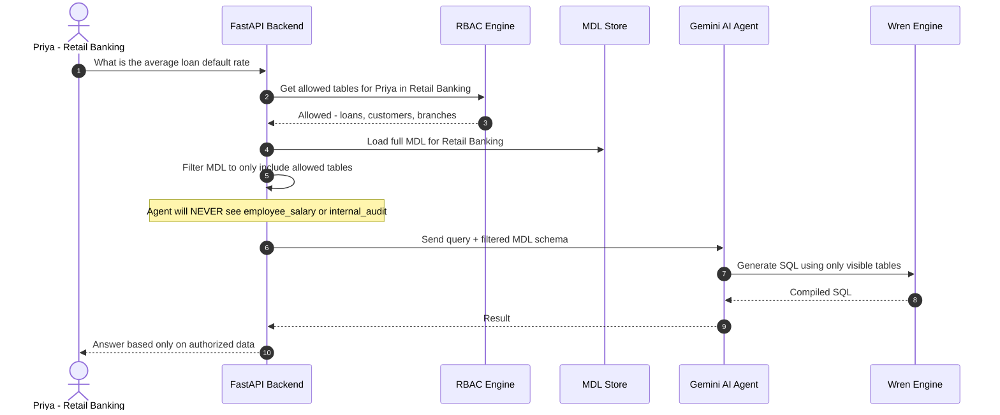

> **Security by Design:** The LLM only receives the filtered MDL. Even if a user asks "show me salary data", the Agent will respond with "I don't have access to salary information" because the table simply doesn't exist in its context.

---

## 4. Data Source Model

Business Units can connect to **different types of data sources**, and **multiple BUs can share the same data source**. Trino acts as the universal query layer that abstracts away the underlying engine.

### 4A. Data Source Sharing

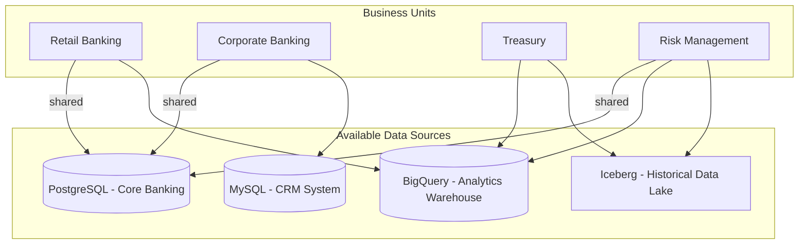

### 4B. How Trino Federates Across Sources

Trino registers each data source as a **catalog**. A single query can join data across catalogs transparently.

| Trino Catalog | Data Source | Example Tables |
|---------------|-----------|----------------|
| `core_banking` | PostgreSQL | accounts, transactions, customers |
| `analytics_wh` | BigQuery | monthly_aggregates, risk_scores |
| `data_lake` | Iceberg on GCS | historical_transactions, archived_loans |
| `crm` | MySQL | leads, contacts, opportunities |

**Example Cross-Source Query (generated by Wren):**
```sql
-- User asks: "Compare current loan defaults with historical trends"
-- Trino executes across PostgreSQL + Iceberg:

SELECT
    cb.loan_type,
    cb.default_count AS current_defaults,
    dl.default_count AS historical_defaults
FROM core_banking.public.loan_defaults cb
JOIN data_lake.archive.loan_defaults_2024 dl
    ON cb.loan_type = dl.loan_type
```

### 4C. Supported Data Sources

| Data Source | Trino Connector | Phase | Notes |
|-------------|----------------|-------|-------|
| PostgreSQL | `postgresql` | Phase 1 | Core transactional data |
| MySQL | `mysql` | Phase 1 | CRM and operational systems |
| SQL Server | `sqlserver` | Phase 1 | Legacy banking systems |
| Google BigQuery | `bigquery` | Phase 1 | Analytics warehouse |
| Apache Iceberg on GCS | `iceberg` | Phase 2 | Historical data lake |
| Oracle DB | `oracle` | Phase 3 | Enterprise systems |
| Snowflake | `snowflake` | Future | If client requires |

---

## 5. Data Source Onboarding Flow

An admin onboards a data source for their Business Unit. The system auto-discovers the schema and generates draft semantic models.

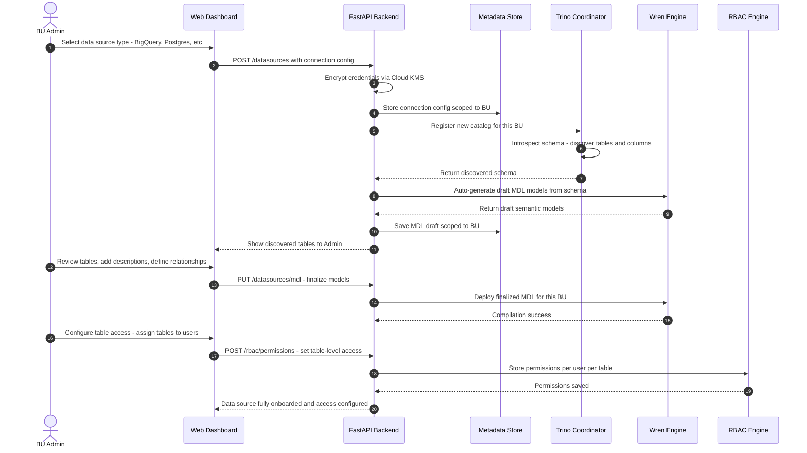

---

## 6. Query Execution Pipeline

The core pipeline has **6 stages**. RBAC enforcement happens at Stage 2, before the AI Agent ever sees the schema.

### 6A. Pipeline Overview

```mermaid
graph LR
    Q["User Question"] --> S1

    subgraph S1 ["Stage 1 - Auth"]
        Auth["Validate JWT"]
        BU_Ctx["Resolve Business Unit"]
    end

    subgraph S2 ["Stage 2 - RBAC"]
        LoadMDL["Load BU Semantic Model"]
        FilterTables["Filter to Allowed Tables"]
    end

    subgraph S3 ["Stage 3 - Intelligence"]
        Vector["Qdrant - Similar Past Queries"]
        LLM["Gemini Agent - Plan and Generate SQL"]
    end

    subgraph S4 ["Stage 4 - Semantic"]
        Compile["Wren - Compile to Native SQL"]
        Validate["Validate Against MDL"]
    end

    subgraph S5 ["Stage 5 - Federation"]
        Route["Trino - Route to Data Sources"]
        Execute["Execute and Join Results"]
    end

    subgraph S6 ["Stage 6 - Response"]
        Format["Format as Markdown Table"]
        Audit["Log to Audit Trail"]
        Cache["Cache to Qdrant"]
    end

    S1 --> S2 --> S3 --> S4 --> S5 --> S6
```

### 6B. Detailed Sequence

```mermaid
sequenceDiagram
    autonumber
    actor User as Bank Employee
    participant GW as API Gateway
    participant Auth as Auth + RBAC
    participant Qdrant as Qdrant Vector DB
    participant Agent as Gemini AI Agent
    participant Wren as Wren Semantic Engine
    participant Trino as Trino Federation
    participant DS as Data Sources

    User->>GW: POST /api/ask - What is total revenue this quarter

    rect rgb(50, 50, 80)
        Note over GW,Auth: Stage 1 + 2 - Auth and RBAC
        GW->>Auth: Validate JWT, extract user_id and tenant_id
        Auth->>Auth: Load full MDL for this BU
        Auth->>Auth: Filter MDL to only tables this user can access
        Auth-->>GW: Filtered MDL + tenant context
    end

    rect rgb(50, 80, 50)
        Note over GW,Agent: Stage 3 - Intelligence
        GW->>Qdrant: Search similar past queries in BU collection
        Qdrant-->>GW: Top-3 cached SQL examples
        GW->>Agent: Send NL query + filtered MDL + cached examples
        Note over Agent: Gemini plans which tool to call
    end

    rect rgb(80, 50, 50)
        Note over Agent,DS: Stage 4 + 5 - Semantic + Federation
        Agent->>Wren: wren_query - semantic SQL
        Wren-->>Agent: Compiled Trino-dialect SQL
        Agent->>Trino: Execute compiled SQL
        Trino->>DS: Route to correct catalog - BigQuery or Postgres or Iceberg
        DS-->>Trino: Raw result rows
        Trino-->>Agent: Result table
    end

    rect rgb(80, 80, 50)
        Note over Agent,GW: Stage 6 - Response
        Agent-->>GW: Formatted answer with SQL and data
        GW->>Qdrant: Cache query-SQL pair in BU collection
        GW-->>User: Stream response with data table
    end
```

### 6C. Wren MDL Role in the Pipeline

Wren's Model Definition Layer is the **critical translation bridge**. It lets users query in business terms while the engine handles the database-specific SQL.

| User Asks | Wren MDL Model | Compiled SQL |
|-----------|---------------|-------------|
| "Total revenue this quarter" | `orders.revenue` mapped to `SUM(total_amount)` | `SELECT SUM(total_amount) FROM core_banking.public.orders WHERE ...` |
| "Risk scores above threshold" | `risk_scores.score` from BigQuery | `SELECT * FROM analytics_wh.risk.scores WHERE score > 0.8` |
| "Historical loan defaults" | `archived_loans` from Iceberg | `SELECT * FROM data_lake.archive.loan_defaults WHERE year = 2024` |
| "Compare current vs historical" | Cross-source relationship | Trino federated JOIN across PostgreSQL + Iceberg |

---

## 7. Security and Network Architecture

All traffic stays within private networks. No banking data touches the public internet.

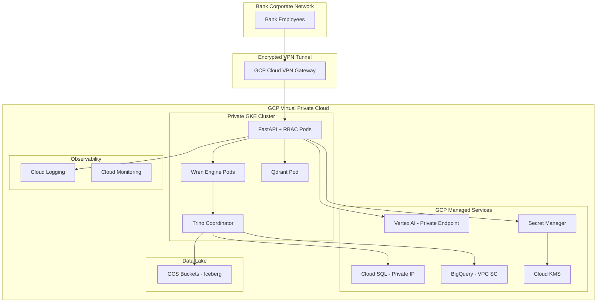

### Security Controls

| Control | Implementation |
|---------|---------------|
| **Network Isolation** | Private GKE cluster, Cloud SQL private IP, VPC Service Controls around BigQuery |
| **Encryption at Rest** | Cloud KMS managed keys for Cloud SQL, GCS, and Secret Manager |
| **Encryption in Transit** | TLS 1.3 on all internal services, IPSec VPN tunnel |
| **Authentication** | JWT tokens issued by platform auth service |
| **Authorization** | Table-level RBAC enforced BEFORE LLM receives schema |
| **Credential Management** | All DB passwords in GCP Secret Manager, never in code or env vars |
| **Audit Trail** | Every query logged: user_id, tenant_id, timestamp, SQL generated, tables accessed, row count |
| **Data Residency** | GCP region locked to comply with RBI data localization norms |
| **LLM Data Safety** | Filtered MDL ensures LLM never sees unauthorized table names or schemas |

---

## 8. GKE Deployment Layout

All application services run as Kubernetes pods inside a private GKE cluster. Each service is independently scalable.

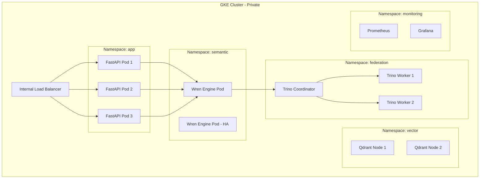

### Pod Scaling Strategy

| Service | Min Pods | Max Pods | Scaling Trigger |
|---------|----------|----------|----------------|
| FastAPI + RBAC | 2 | 10 | CPU above 70% |
| Wren Engine | 1 | 4 | Request queue depth |
| Trino Coordinator | 1 | 1 | Single coordinator pattern |
| Trino Workers | 2 | 8 | Query queue length |
| Qdrant | 2 | 4 | Memory above 80% |

---

## 9. Technology Stack

| Category | Technology | Purpose |
|----------|-----------|---------|
| **Backend Framework** | FastAPI - Python | REST API, RBAC middleware, orchestration |
| **AI/LLM** | Gemini 2.5 Flash via Vertex AI | NL to SQL generation, result summarization |
| **Agent Framework** | Pydantic AI | Tool-calling agent with structured outputs |
| **Semantic Layer** | Wren AI Engine | Business model definitions, SQL compilation |
| **Query Federation** | Trino | Route queries across Postgres, BigQuery, Iceberg |
| **Vector Database** | Qdrant | Cache past queries, semantic similarity search |
| **SQL Databases** | Cloud SQL for PostgreSQL, MySQL, SQL Server | Transactional banking data |
| **Analytics Warehouse** | Google BigQuery | Large-scale analytics and aggregations |
| **Data Lakehouse** | Apache Iceberg on GCS | Historical data, time-travel queries |
| **Container Orchestration** | Google Kubernetes Engine | Pod management, auto-scaling |
| **Secret Management** | GCP Secret Manager + Cloud KMS | Credential storage and encryption |
| **Monitoring** | Cloud Logging, Monitoring, Trace | Observability and alerting |
| **CI/CD** | Cloud Build + Artifact Registry | Automated build and deployment |

---

## 10. Phased Delivery Roadmap

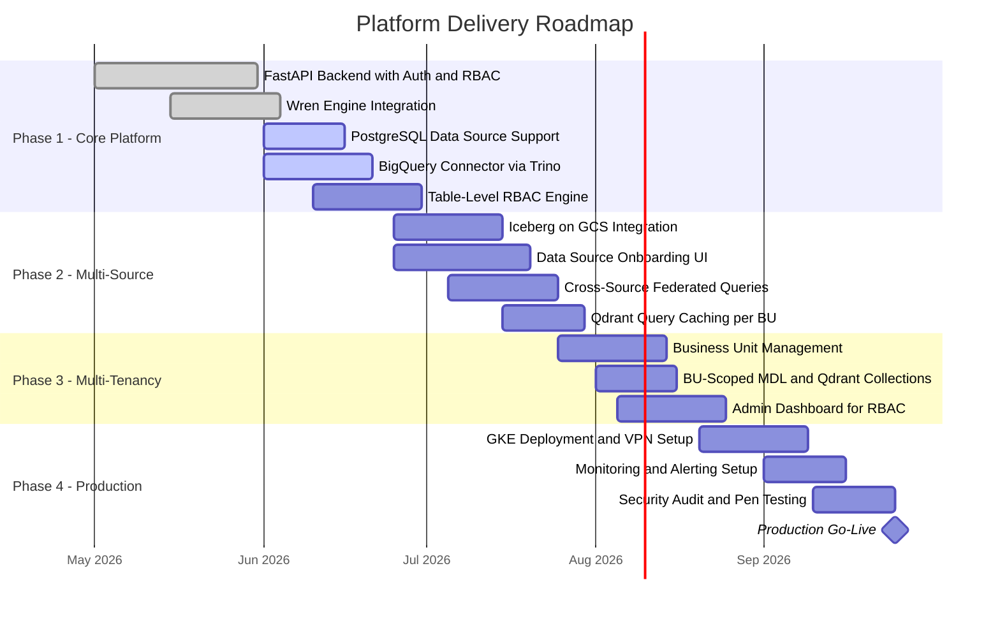

### Phase Summary

| Phase | Duration | Key Deliverables |
|-------|----------|-----------------|
| **Phase 1** | 6 weeks | Query pipeline with PostgreSQL and BigQuery, JWT auth, table-level RBAC engine |
| **Phase 2** | 5 weeks | Iceberg lakehouse, data source onboarding UI, cross-source joins, query caching |
| **Phase 3** | 4 weeks | Full BU-based multi-tenancy, admin dashboard for managing table permissions |
| **Phase 4** | 5 weeks | GKE production deployment, monitoring, security audit, go-live |

---

## Appendix A: API Surface

| Endpoint | Method | Description |
|----------|--------|-------------|
| `/api/auth/login` | POST | Authenticate user, return JWT with tenant_id claims |
| `/api/ask` | POST | Submit natural language query |
| `/api/ask/stream` | POST | Stream query response via SSE |
| `/api/datasources` | GET | List onboarded data sources for current BU |
| `/api/datasources` | POST | Onboard new data source - Admin only |
| `/api/datasources/{id}/schema` | GET | View discovered tables and columns |
| `/api/datasources/{id}/mdl` | PUT | Update semantic model for data source |
| `/api/datasources/{id}/test` | POST | Test data source connectivity |
| `/api/rbac/permissions` | GET | List table permissions for a user in current BU |
| `/api/rbac/permissions` | POST | Grant or revoke table access - Admin only |
| `/api/business-units` | GET/POST | Manage business units - Super Admin only |
| `/api/users` | GET/POST | Manage users within BU |
| `/api/audit/queries` | GET | View query audit logs for current BU |

## Appendix B: MDL Model Example

```yaml
# Wren Model Definition - scoped to BU "Retail Banking"
# Data sources: PostgreSQL (core_banking) + BigQuery (analytics_wh)

models:
  - name: accounts
    table_reference: "core_banking.public.accounts"
    columns:
      - name: account_id
        type: INTEGER
        description: "Unique account identifier"
      - name: customer_id
        type: INTEGER
        description: "FK to customers table"
      - name: balance
        type: DECIMAL
        description: "Current account balance in INR"
      - name: account_type
        type: STRING
        description: "savings, current, or fixed_deposit"
    calculated_fields:
      - name: total_balance
        expression: "SUM(balance)"
        description: "Aggregate balance across accounts"

  - name: risk_scores
    table_reference: "analytics_wh.risk.customer_scores"
    columns:
      - name: customer_id
        type: INTEGER
      - name: risk_score
        type: FLOAT
        description: "ML-generated risk score 0 to 1"
      - name: computed_date
        type: DATE
    relationships:
      - name: customer_account
        model: accounts
        join_type: MANY_TO_ONE
        condition: "risk_scores.customer_id = accounts.customer_id"

  - name: historical_transactions
    table_reference: "data_lake.archive.transactions_2024"
    columns:
      - name: txn_id
        type: STRING
      - name: account_id
        type: INTEGER
      - name: amount
        type: DECIMAL
      - name: txn_date
        type: TIMESTAMP
```

## Appendix C: RBAC Permission Schema

```sql
-- Platform metadata database

CREATE TABLE tenants (
    tenant_id     VARCHAR PRIMARY KEY,
    tenant_name   VARCHAR NOT NULL,
    created_at    TIMESTAMP DEFAULT NOW()
);

CREATE TABLE users (
    user_id     VARCHAR PRIMARY KEY,
    email       VARCHAR UNIQUE NOT NULL,
    name        VARCHAR NOT NULL,
    created_at  TIMESTAMP DEFAULT NOW()
);

CREATE TABLE user_tenant_membership (
    user_id     VARCHAR REFERENCES users(user_id),
    tenant_id   VARCHAR REFERENCES tenants(tenant_id),
    role        VARCHAR NOT NULL,  -- 'admin', 'analyst', 'viewer'
    PRIMARY KEY (user_id, tenant_id)
);

CREATE TABLE table_permissions (
    id            SERIAL PRIMARY KEY,
    user_id       VARCHAR REFERENCES users(user_id),
    tenant_id     VARCHAR REFERENCES tenants(tenant_id),
    datasource_id VARCHAR NOT NULL,
    table_name    VARCHAR NOT NULL,
    access        VARCHAR NOT NULL DEFAULT 'READ',  -- 'READ' or 'DENY'
    granted_by    VARCHAR REFERENCES users(user_id),
    granted_at    TIMESTAMP DEFAULT NOW(),
    UNIQUE (user_id, tenant_id, datasource_id, table_name)
);
```

---

> This document is a living specification. Architecture decisions will be validated during each phase and updated as the platform evolves.
