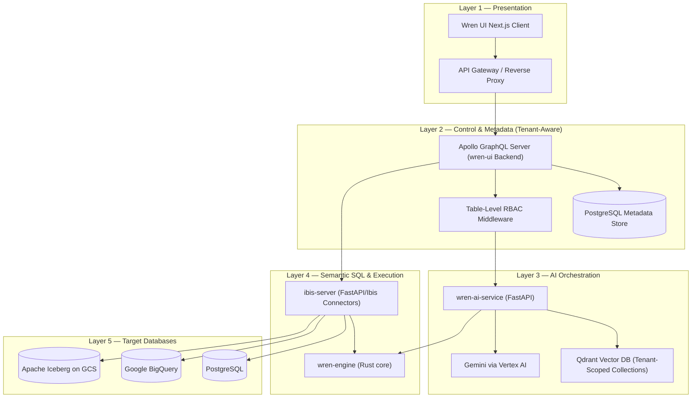
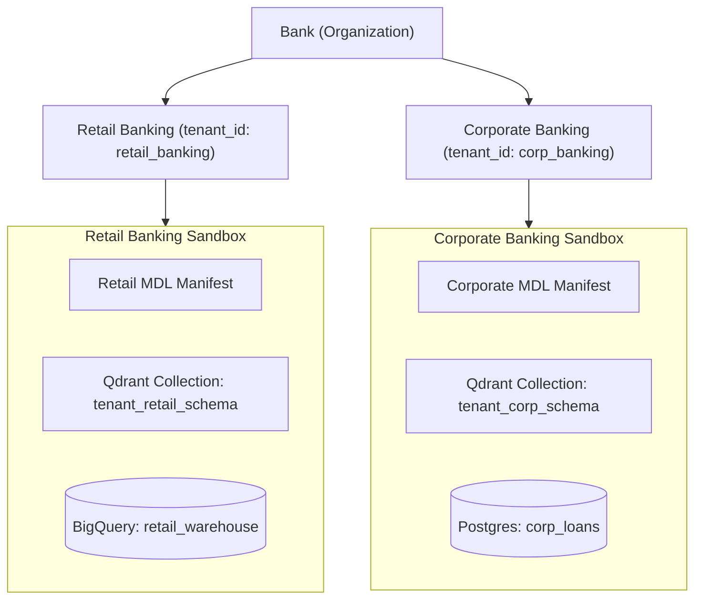
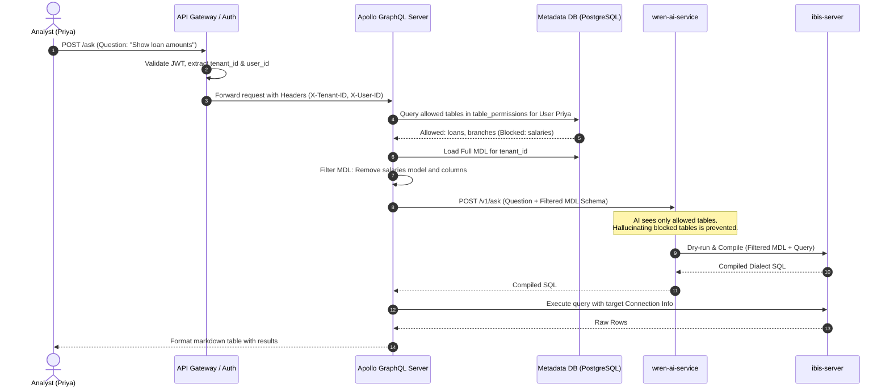

# Semantic Analytics Platform — HLD (Wren Legacy v1)

**Project:** Conversational Data Query Platform for Banking (Legacy v1 Stack)  
**Version:** 1.0  
**Deployment:** Google Cloud Platform (GKE) — Private Network Isolation

---

## 1. Multi-Tenant System Architecture

The platform adapts the components from the Wren `legacy/v1` architecture to provide multi-tenant query intelligence and database access across different business units (BUs) within the bank. 

### Component Breakdown & Responsibilities

| Component | Technology | Multi-Tenant Responsibility |
|:---|:---|:---|
| **Wren UI Client** | Next.js, React | Exposes the web console, schema builder, dashboard, and conversation threads. Routes user session with `tenant_id` context. |
| **Apollo GraphQL Server** | Node.js, Apollo | The backend for `wren-ui`. Persists schema metadata, user preferences, and chat history. Scopes all queries and mutations by `tenant_id`. |
| **Metadata Store** | PostgreSQL (migrated from SQLite) | Central database storing project, model, column, metric, relationship, thread, and permissions tables, isolated using `tenant_id`. |
| **wren-ai-service** | FastAPI, Python | Manages AI pipelines (intent classification, SQL planning, corrections). Communicates with Qdrant and LLM, routing requests to tenant-isolated vector namespaces. |
| **Qdrant Vector DB** | Qdrant | Stores high-dimensional vector embeddings of schemas and historical queries. Isolated by utilizing tenant-specific collections. |
| **ibis-server** | FastAPI, Ibis, SQLGlot | A Python-based database execution service. Receives connection credentials and compiled MDL manifests dynamically on each request to fetch metadata or execute queries. |
| **wren-engine** | Rust, PyO3 bindings | Rust-based semantic SQL compiler (`wren-core`) that validates and compiles semantic queries into native SQL dialetcs. Runs statelessly. |

---

## 2. Multi-Tenancy Design Model

The banking environment requires strict isolation between different business units (e.g., Retail Banking, Corporate Banking, Risk, Treasury).

### Isolation Vector Matrix

*   **User Identity & Session:** Users authenticate at the API Gateway. The resulting JWT carries the user's roles and `tenant_id` (representing their business unit).
*   **Metadata DB (PostgreSQL):** A shared-database, shared-schema architecture is used. Every table has a `tenant_id` column. Every database query executed by `wren-ui`'s backend includes an explicit filter: `WHERE tenant_id = <current_tenant_id>`.
*   **Semantic Model (MDL):** Since the `wren-engine` and `ibis-server` compile SQL dynamically by accepting the MDL JSON string in the request payload, we store the MDL schema in the metadata database scoped by `tenant_id`. It is compiled and transmitted on-the-fly per tenant request.
*   **AI Context & Embeddings:** Embeddings are indexed in Qdrant. To prevent leakage, `wren-ai-service` dynamically prefixes Qdrant collections with `tenant_{tenant_id}_`.

---

## 3. Table-Level RBAC Enforcement

Within any business unit, users have varying access rights. For example, a Retail Analyst can view the `loans` table but is blocked from the `salary` table.

---

## 4. Query Federation & Data Source Connectivity

`ibis-server` connects to target databases using Ibis connectors. In our banking environment, BUs register their data sources via `wren-ui`.

*   **Federation:** For cross-database joins (e.g. Postgres transactional data joined with BigQuery historical data), queries are federated through a central **Trino** coordinator.
*   **Stateless execution:** When running a query or fetching metadata, `wren-ui` retrieves the encrypted connection details from its database, decrypts them, and sends them inside the request payload to `ibis-server`. This ensures `ibis-server` never has to maintain persistent connection states or credentials.

---

## 5. Security & Isolation Controls

1.  **VPC Service Controls:** GKE pods run in private namespaces.
2.  **KMS Encryption:** All database connection strings and passwords stored in the PostgreSQL database are encrypted at rest using GCP KMS.
3.  **No Schema Leakage to LLM:** Because the schema is pruned dynamically at the Apollo gateway layer, the LLM is entirely unaware of the existence of unauthorized database tables, preventing any indirect data discovery.
