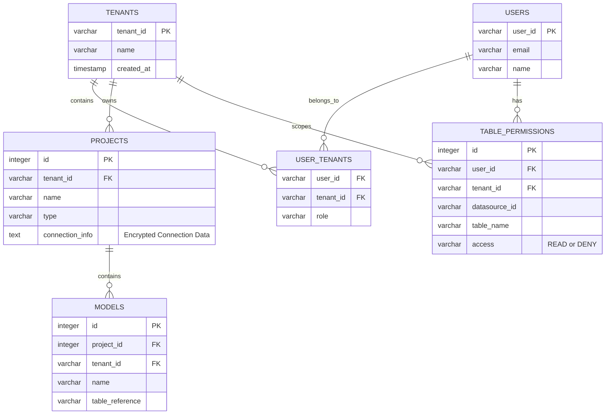
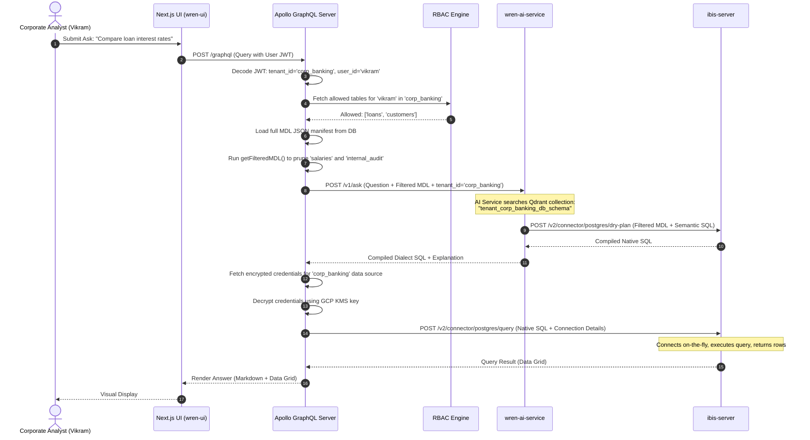

# Low-Level Design Document (Wren Legacy v1)

**Project:** Semantic Analytics Platform  
**Version:** 1.0  
**Target Branch:** legacy/v1  

---

## 1. Database Schema Design (Metadata Store)

To transition from a single-user SQLite setup to a multi-tenant PostgreSQL metadata database, we must modify the existing database schemas. Every tenant is identified by a `tenant_id` (Business Unit ID).



### 1A. Knex Schema Migration Example (Node.js / wren-ui)

The Knex migration scripts in [wren-ui/migrations](file:///Users/harshit/Desktop/SN/WrenAI_repo/wren-ui/migrations) must be extended to include `tenant_id` fields.

```javascript
// Migration: add_tenant_id_to_projects.js
exports.up = function(knex) {
  return knex.schema
    .alterTable('project', function(table) {
      table.string('tenant_id').notNullable().defaultTo('retail_banking');
      table.index(['tenant_id']);
    })
    .alterTable('model', function(table) {
      table.string('tenant_id').notNullable().defaultTo('retail_banking');
      table.index(['tenant_id']);
    })
    .createTable('table_permissions', function(table) {
      table.increments('id').primary();
      table.string('user_id').notNullable();
      table.string('tenant_id').notNullable();
      table.string('datasource_id').notNullable();
      table.string('table_name').notNullable();
      table.string('access').notNullable().defaultTo('READ'); // 'READ' or 'DENY'
      table.unique(['user_id', 'tenant_id', 'datasource_id', 'table_name']);
    });
};

exports.down = function(knex) {
  return knex.schema
    .dropTableIfExists('table_permissions')
    .alterTable('project', function(table) {
      table.dropColumn('tenant_id');
    })
    .alterTable('model', function(table) {
      table.dropColumn('tenant_id');
    });
};
```

---

## 2. API Context Plumbing & Routing

All requests coming through the Presentation Layer must carry tenant identifiers. 

### 2A. Request Header Strategy
The API Gateway forwards requests to `wren-ui` with authentication headers resolved from the JWT token:
*   `X-Tenant-ID`: The tenant ID associated with the user's current business unit.
*   `X-User-ID`: The user ID.

### 2B. GraphQL Context Setup (wren-ui/src/apollo/server/config.ts)

Configure the Apollo server context to capture these headers and make them available to all repositories:

```typescript
export interface Context {
  tenantId: string;
  userId: string;
  // Existing fields...
}

export const createContext = ({ req }): Context => {
  const tenantId = req.headers['x-tenant-id'] || 'default';
  const userId = req.headers['x-user-id'] || 'anonymous';
  return { tenantId, userId };
};
```

### 2C. Scoping Knex Queries
All repository queries inside `wren-ui/src/apollo/server/repositories` must be modified to apply the tenant filter automatically.

```typescript
// Example: wren-ui/src/apollo/server/repositories/projectRepository.ts
export class ProjectRepository {
  private knex;
  
  constructor(knex) {
    this.knex = knex;
  }

  public async findProject(id: number, ctx: Context) {
    return this.knex('project')
      .where({ id, tenant_id: ctx.tenantId })
      .first();
  }

  public async listProjects(ctx: Context) {
    return this.knex('project')
      .where({ tenant_id: ctx.tenantId });
  }
}
```

---

## 3. Dynamic MDL Filtering (Table-Level RBAC)

Before the semantic model (MDL manifest JSON) is sent to `wren-ai-service` or `ibis-server`, `wren-ui`'s server must intercept and filter it using the `table_permissions` table.

### 3A. MDL Pruning Algorithm (TypeScript)

This routine strips out unauthorized models, columns, and relations from the manifest:

```typescript
import { Manifest } from '../mdl/type';

export async function getFilteredMDL(
  fullManifest: Manifest,
  allowedTables: Set<string>
): Promise<Manifest> {
  // 1. Filter models to only those that are allowed
  const filteredModels = fullManifest.models.filter((model) =>
    allowedTables.has(model.tableReference || model.name)
  );

  // 2. Extract the set of allowed model names
  const allowedModelNames = new Set(filteredModels.map((m) => m.name));

  // 3. Prune relationship definitions that reference removed models
  const filteredRelationships = (fullManifest.relationships || []).filter(
    (rel) =>
      allowedModelNames.has(rel.models[0]) && allowedModelNames.has(rel.models[1])
  );

  // 4. Prune relationship columns inside the remaining models
  filteredModels.forEach((model) => {
    model.columns = model.columns.filter((column) => {
      // If column is a relationship, verify the target model is allowed
      if (column.relationship) {
        const rel = filteredRelationships.find((r) => r.name === column.relationship);
        return rel !== undefined;
      }
      return true;
    });
  });

  return {
    ...fullManifest,
    models: filteredModels,
    relationships: filteredRelationships,
  };
}
```

---

## 4. Qdrant Isolation (wren-ai-service)

The `wren-ai-service` indexes schemas and queries in Qdrant collections.

### 4A. Tenant Collection Naming
Qdrant does not natively offer database-level tenancy. Instead, we scope collections by naming convention. When creating or reading collections in `wren-ai-service/src/pipelines/indexing.py` and `retrieval.py`, prefix the collection names using `tenant_id`:

```python
# python code inside wren-ai-service/src/pipelines/indexing.py
class DBSchemaIndexing:
    def __init__(self, qdrant_client, embedder):
        self.qdrant = qdrant_client
        self.embedder = embedder

    def index_schema(self, tenant_id: str, manifest: dict):
        collection_name = f"tenant_{tenant_id}_db_schema"
        
        # Ensure collection exists for this specific tenant
        if not self.qdrant.collection_exists(collection_name):
            self.qdrant.create_collection(
                collection_name=collection_name,
                vectors_config=self.embedder.get_vector_config()
            )
            
        # Index models...
```

---

## 5. Sequence Diagram: Dynamic Auth & Query Execution


