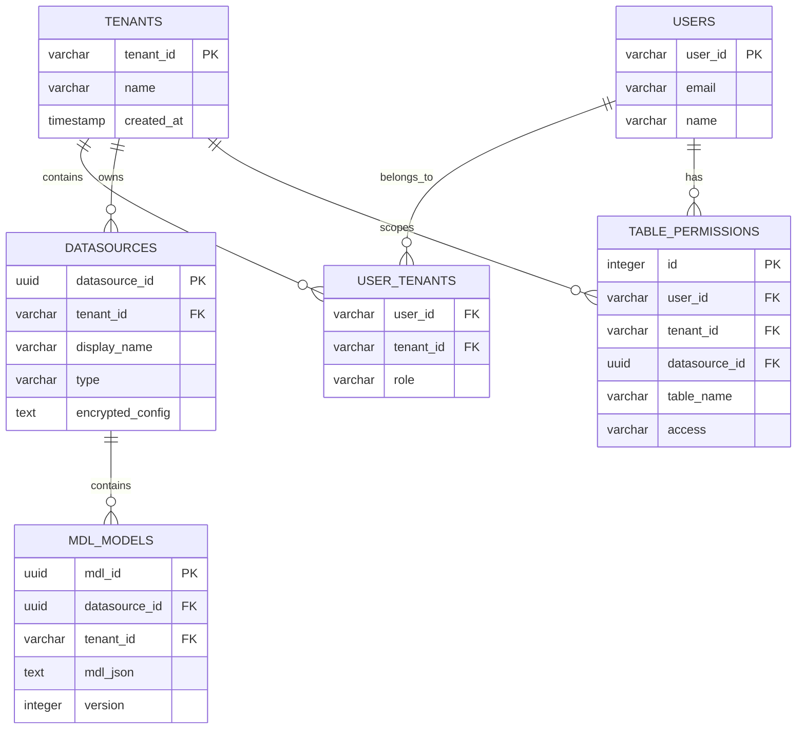
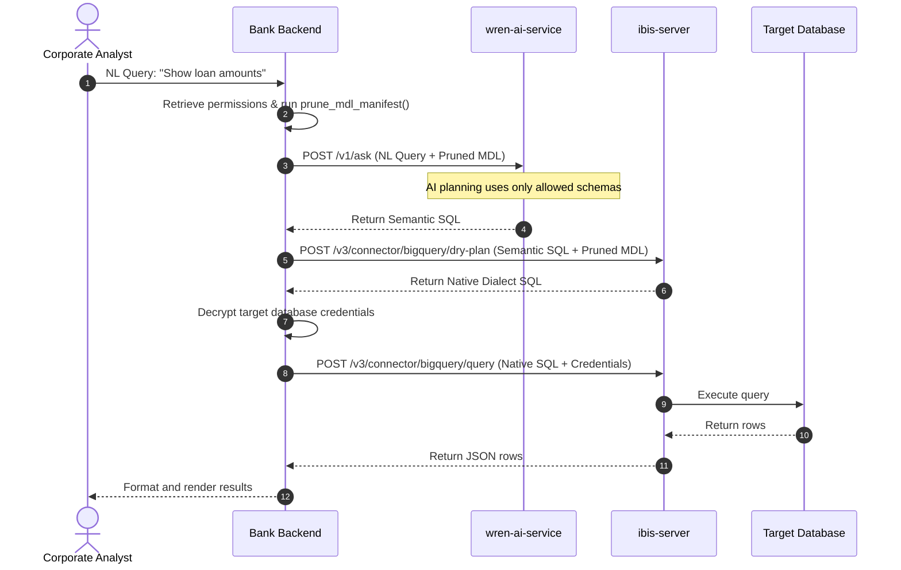

# Low-Level Design Document (Wren Legacy v1 - Minimized Management)

**Project:** Semantic Analytics Platform  
**Version:** 1.0  
**Architecture:** Bypassed UI / Stateless Compilation / Partitioned AI Pods  

---

## 1. Database Schema Design (Bank's Custom Metadata Store)

Since we are bypassing the single-user SQLite backend of `wren-ui` in production, your bank's own relational database (PostgreSQL) acts as the single source of truth for configuration, permissions, and tenant metadata.

### Entity Relationship Model (Text Description)
```text
+------------------+       +-------------------+       +--------------------+
|     TENANTS      |       |   USER_TENANTS    |       |       USERS        |
|------------------|       |-------------------|       |--------------------|
| tenant_id (PK)   |<------+ tenant_id (FK)    |       | user_id (PK)       |
| name             |       | role              |       | email              |
| created_at       |       | user_id (FK)      +------>| name               |
+--------+---------+       +-------------------+       +---------+----------+
         |                                                       |
         | (1-to-Many)                                           | (1-to-Many)
         v                                                       v
+--------+---------+                                   +---------+----------+
|   DATASOURCES    |                                   | TABLE_PERMISSIONS  |
|------------------|                                   |--------------------|
| datasource_id(PK)|                                   | id (PK)            |
| tenant_id (FK)   |                                   | user_id (FK)       |
| display_name     |                                   | tenant_id (FK)     |
| type (BQ/Postgres|                                   | datasource_id (FK) |
| encrypted_config |                                   | table_name         |
+--------+---------+                                   | access (READ/DENY) |
         |                                                 +--------------------+
         | (1-to-Many)
         v
+--------+---------+
|    MDL_MODELS    |
|------------------|
| mdl_id (PK)      |
| datasource_id(FK)|
| tenant_id (FK)   |
| mdl_json (Text)  |
| version          |
+------------------+
```



### 1B. Complete DDL for Bank Metadata Store
```sql
-- Tenants (Business Units)
CREATE TABLE tenants (
    tenant_id     VARCHAR(100) PRIMARY KEY,
    tenant_name   VARCHAR(255) NOT NULL,
    created_at    TIMESTAMP DEFAULT NOW()
);

-- Data Sources (Managed by Bank, not stored in Wren)
CREATE TABLE datasources (
    datasource_id     UUID PRIMARY KEY DEFAULT gen_random_uuid(),
    tenant_id         VARCHAR(100) REFERENCES tenants(tenant_id) ON DELETE CASCADE,
    display_name      VARCHAR(255) NOT NULL,
    source_type       VARCHAR(50) NOT NULL, -- 'bigquery', 'postgresql', 'iceberg'
    encrypted_config  TEXT NOT NULL,         -- KMS encrypted credentials
    created_at        TIMESTAMP DEFAULT NOW()
);

-- MDL Models (Engineered via Dev UI, stored here for production)
CREATE TABLE mdl_models (
    mdl_id            UUID PRIMARY KEY DEFAULT gen_random_uuid(),
    datasource_id     UUID REFERENCES datasources(datasource_id) ON DELETE CASCADE,
    tenant_id         VARCHAR(100) REFERENCES tenants(tenant_id) ON DELETE CASCADE,
    mdl_json          TEXT NOT NULL, -- JSON manifest string
    version           INTEGER NOT NULL DEFAULT 1,
    created_at        TIMESTAMP DEFAULT NOW(),
    UNIQUE(tenant_id, datasource_id, version)
);

-- Table-Level Permissions (Enforced by Bank Backend)
CREATE TABLE table_permissions (
    id                SERIAL PRIMARY KEY,
    user_id           VARCHAR(100) NOT NULL,
    tenant_id         VARCHAR(100) REFERENCES tenants(tenant_id) ON DELETE CASCADE,
    datasource_id     UUID REFERENCES datasources(datasource_id) ON DELETE CASCADE,
    table_name        VARCHAR(255) NOT NULL,
    access            VARCHAR(10) NOT NULL DEFAULT 'READ', -- 'READ' or 'DENY'
    granted_at        TIMESTAMP DEFAULT NOW(),
    UNIQUE(user_id, tenant_id, datasource_id, table_name)
);
```

---

## 2. Dynamic MDL Pruning Code (Bank Backend)

When a query is received, your bank's custom backend (e.g., Python/FastAPI) loads the full MDL manifest from the database, retrieves the user's permitted tables, and prunes the schema before forwarding it to the stateless compilation services.

### Python MDL Pruning Script
```python
import json

def prune_mdl_manifest(full_manifest_str: str, allowed_tables: list[str]) -> str:
    """
    Prunes a Wren MDL JSON manifest string down to allowed tables.
    Removes unauthorized models, and cleans relationships referring to them.
    
    :param full_manifest_str: Raw JSON manifest string from database.
    :param allowed_tables: List of physical table references the user can access.
    """
    manifest = json.loads(full_manifest_str)
    allowed_set = set(allowed_tables)
    
    # 1. Filter models
    filtered_models = []
    allowed_model_names = set()
    
    for model in manifest.get("models", []):
        ref = model.get("tableReference") or model.get("name")
        if ref in allowed_set:
            filtered_models.append(model)
            allowed_model_names.add(model.get("name"))
            
    # 2. Filter relationships
    filtered_relationships = []
    for rel in manifest.get("relationships", []):
        models = rel.get("models", [])
        if len(models) == 2 and models[0] in allowed_model_names and models[1] in allowed_model_names:
            filtered_relationships.append(rel)
            
    # 3. Clean relationship columns in remaining models
    relationship_names = set(r.get("name") for r in filtered_relationships)
    for model in filtered_models:
        cleaned_columns = []
        for col in model.get("columns", []):
            rel_name = col.get("relationship")
            if rel_name is None or rel_name in relationship_names:
                cleaned_columns.append(col)
        model["columns"] = cleaned_columns

    manifest["models"] = filtered_models
    manifest["relationships"] = filtered_relationships
    
    return json.dumps(manifest)
```

---

## 3. Stateless API Orchestration Flow

Your bank's custom backend acts as the orchestrator. It intercepts natural language questions, calls the stateless `wren-ai-service` to get the semantic SQL, compiles it to native SQL using `ibis-server`, and fetches the data.

### Sequence diagram (Text Description)
```text
[Analyst User]    [Bank Backend]    [wren-ai-service]    [ibis-server]      [Database]
      |                 |                   |                 |                 |
      |--1. NL Query--->|                   |                 |                 |
      |   ("Show sales")|                   |                 |                 |
      |                 |--2. Prune MDL---->|                 |                 |
      |                 |--3. Ask v1/ask--->|                 |                 |
      |                 |   (Pruned MDL)    |                 |                 |
      |                 |<--4. Semantic SQL-|                 |                 |
      |                 |                   |                 |                 |
      |                 |--5. POST dry-plan------------------>|                 |
      |                 |   (Semantic SQL + Pruned MDL)       |                 |
      |                 |<--6. Native Dialect SQL-------------|                 |
      |                 |                   |                 |                 |
      |                 |--7. Decrypt DB Credentials          |                 |
      |                 |--8. POST query--------------------->|                 |
      |                 |   (Native SQL + Credentials)        |--9. Execute---->|
      |                 |                                     |<--10. Rows------|
      |                 |<--11. JSON Rows---------------------|                 |
      |<--12. Results---|                   |                 |                 |
```



---

## 4. Multi-Tenant Deployment & Routing Layout

To guarantee complete tenant isolation with zero code customization, we run tenant-scoped instances of `wren-ai-service` and `qdrant` in Kubernetes, routing requests dynamically based on the user's `tenant_id`.

```text
                             +-------------------+
                             |    API Gateway    |
                             +---------+---------+
                                       | (tenant_id)
                                       v
                             +---------+---------+
                             |   Bank Backend    |
                             +----+----+----+----+
                                  |    |    |
        +-------------------------+    |    +-------------------------+
        | (retail_banking)             | (corp_banking)               | (treasury)
        v                              v                              v
+-------+-------------+        +-------+-------------+        +-------+-------------+
| AI Service (Retail) |        | AI Service (Corp)   |        | AI Service (Treas)  |
| - Qdrant (Retail)   |        | - Qdrant (Corp)     |        | - Qdrant (Treas)    |
+-------+-------------+        +-------+-------------+        +-------+-------------+
        |                              |                              |
        +------------------------------+------------------------------+
                                       v (Stateless Routing)
                             +---------+---------+
                             |    ibis-server    | (Shared Stateless Connector)
                             +---------+---------+
                                       |
                                       v
                            [Destination Databases]
```
