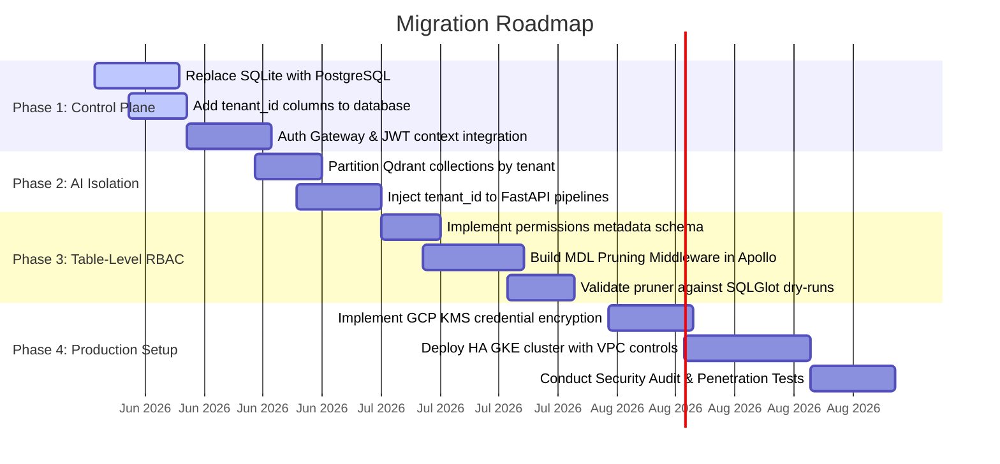

# Multi-Tenancy Roadmap (Wren Legacy v1)

This roadmap details the phased development plan to convert the single-user, local setup of Wren `legacy/v1` into an isolated, multi-tenant enterprise analytics engine.



---

## Phase 1: Control Plane & Metadata Migration

### Goal: Migrate data model storage and resolve tenant context from user requests.

1.  **Database Engine Migration:**
    *   Replace SQLite (`SQLITE_FILE`) in `wren-ui` with a central high-availability PostgreSQL database (e.g. Google Cloud SQL).
    *   Update [wren-ui/knexfile.js](file:///Users/harshit/Desktop/SN/WrenAI_repo/wren-ui/knexfile.js) to support PostgreSQL connection pooling.
2.  **Schema Refactoring:**
    *   Create a Knex migration to alter all primary tables (`project`, `model`, `relation`, `metrics`, `view`, `ask`, `dashboard`, `sql_pair`, `instruction`) adding a `tenant_id` column.
    *   Set composite indexes on `(tenant_id, id)` for optimized tenant queries.
3.  **GraphQL Middleware Scoping:**
    *   Update Next.js API route handler to extract JWT payload claims (e.g., `tenant_id` and `user_id`) from incoming request headers (`X-Tenant-ID`, `X-User-ID`).
    *   Plumb the tenant context into Apollo data sources and update resolvers to filter all database selections by `tenant_id`.

---

## Phase 2: AI Orchestration & Vector Isolation

### Goal: Partition search indexes in Qdrant to prevent cross-tenant leakages during schema retrieval.

1.  **Qdrant Client Namespace Plumbing:**
    *   Modify `wren-ai-service/src/globals.py` and the pipeline classes under `wren-ai-service/src/pipelines/indexing.py` and `retrieval.py`.
    *   For every index/search tool call, prepend the active `tenant_id` to the target collection name:
        ```python
        collection = f"tenant_{tenant_id}_db_schema"
        ```
2.  **FastAPI Endpoint Upgrades:**
    *   Modify routers in `wren-ai-service/src/web/v1/routers/` (e.g. `/v1/ask`, `/v1/semantics_preparation`) to accept `tenant_id` in request headers or body.
    *   Ensure all logging frameworks (such as Langfuse) tag telemetry data with the corresponding `tenant_id` for audits.

---

## Phase 3: Table-Level RBAC (Dynamic MDL Filtering)

### Goal: Dynamically restrict schema visibility before LLM generation based on table access controls.

1.  **RBAC Database Administration:**
    *   Create and migrate the `table_permissions` table (maps `user_id` + `tenant_id` to individual table names and access states: `READ` or `DENY`).
    *   Provide GraphQL endpoints in `wren-ui` allowing admins to set/revoke access rights.
2.  **MDL Pruning Middleware:**
    *   Implement the pruning algorithm inside `wren-ui`'s Apollo backend (referenced in LLD Section 3A).
    *   When `/graphql` receives an ask request, fetch the user's permitted tables, load the full tenant MDL, run the pruner, and send only the **pruned** MDL manifest to `wren-ai-service`.
3.  **Compiler Validation:**
    *   Run tests to verify that if a user submits a query referencing a denied table name, the compilation fails gracefully during the `ibis-server` dry-run phase since the table reference is missing.

---

## Phase 4: Productionization & Security Hardening

### Goal: Secure database connection parameters and scale components on GKE.

1.  **Credential Encryption at Rest:**
    *   Configure GCP KMS (Key Management Service) integration.
    *   Encrypt `connection_info` inside `project` table before persisting. Decrypt only in memory in `wren-ui` resolvers when sending payloads to `ibis-server`.
2.  **GKE High-Availability Cluster:**
    *   Package services (`wren-ui`, `wren-ai-service`, `ibis-server`) into Docker images.
    *   Write Kubernetes deployment manifests specifying resource limits, replicas, and pod anti-affinity.
    *   Use horizontal pod autoscalers (HPA) triggered by CPU/Memory.
3.  **VPC Service Controls:**
    *   Confine all traffic within a Private VPC.
    *   Configure private service connect endpoints for Vertex AI API calls.
