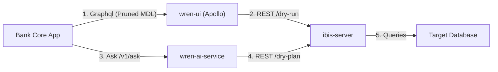
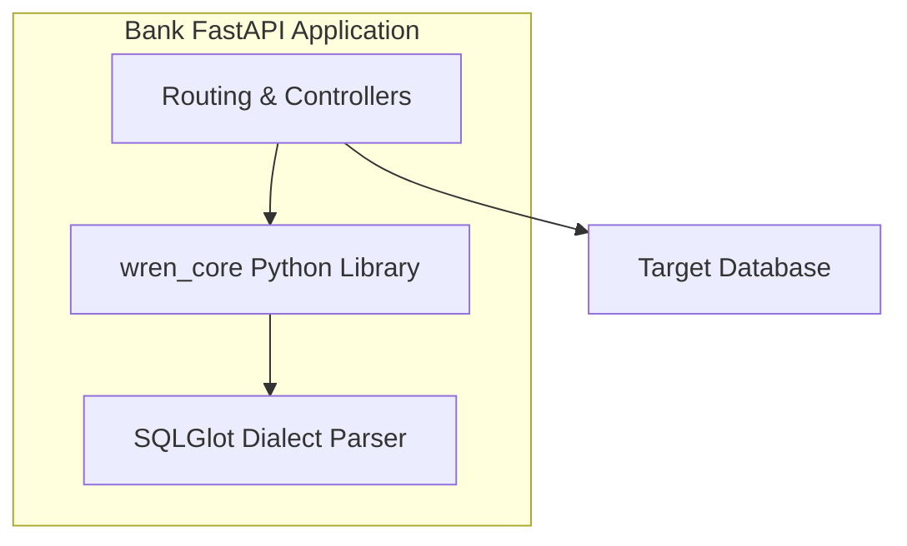

# Wren Integration Guide: Container-as-a-Service vs. Embedded SDK

**Project:** Semantic Analytics Platform  
**Version:** 1.0  
**Target Branch:** legacy/v1  

---

When integrating the legacy Wren engine into our banking platform, we have two primary architectural options: **Container-as-a-Service (CaaS)** (deploying Wren components as separate Docker containers on GKE and interacting via APIs) or **Embedded Library/SDK** (compiling the Rust `wren-core` engine and integrating it directly into our Python backend code).

Below is a detailed analysis of both options, along with exact code implementation examples.

---

## Option 1: Container-as-a-Service (CaaS) - [RECOMMENDED]

In this model, Wren runs as a set of isolated microservices deployed in our GKE cluster. Our bank's core application backend interacts with them using HTTP REST and GraphQL.

### System Flow (ASCII Representation)
```text
                     +-----------------------+
                     |     Bank Core App     |
                     +---+---------------+---+
                         |               |
        1. GraphQL query |               | 3. Ask request
         (with pruned    |               |  (natural language)
          MDL schema)    v               v
                +--------+------+  +-----+-----------+
                |    wren-ui    |  | wren-ai-service |
                | (Apollo GQL)  |  |    (FastAPI)    |
                +--------+------+  +-----+-----------+
                         |               |
         2. REST dry-run |               | 4. REST dry-plan
                         v               v
                +--------+---------------+-----------+
                |            ibis-server             |
                |             (FastAPI)              |
                +--------------------+---------------+
                                     |
                                     | 5. Execute query
                                     v
                            +--------+-------+
                            | Target Database|
                            +----------------+
```



### Why it is Recommended
*   **Decoupled Architecture:** Our banking backend can be written in any language (Go, Java, Python).
*   **Pre-built Pipelines:** We leverage `wren-ai-service`'s full LLM orchestration, semantic caching (Qdrant), and feedback loop out-of-the-box.
*   **Out-of-the-box UI:** Allows business admins to build models, define relationships, and manage metrics using `wren-ui` directly.

### Exact API Usage Code Example
Here is how our banking backend queries the containerized services to retrieve database results from a natural language question.

```python
import httpx
import json

# Setup endpoints
WREN_AI_ENDPOINT = "http://wren-ai-service:8000"
IBIS_SERVER_ENDPOINT = "http://ibis-server:8002"

async def get_conversational_answer(user_question: str, tenant_id: str, filtered_mdl_manifest: dict):
    # 1. Submit question to wren-ai-service to get the semantic SQL
    async with httpx.AsyncClient() as client:
        ai_response = await client.post(
            f"{WREN_AI_ENDPOINT}/v1/ask",
            json={
                "query": user_question,
                "manifest": filtered_mdl_manifest,
                "history": []
            },
            headers={"X-Tenant-ID": tenant_id}
        )
        ai_data = ai_response.json()
        semantic_sql = ai_data["sql"]  # SQL referencing semantic models
        
        # 2. Compile semantic SQL to native BigQuery/PostgreSQL SQL using ibis-server
        connection_info = {
            "projectId": "bank-prod-dw",
            "datasetId": "retail_banking",
            "credentials": "BASE64_ENCRYPTED_SERVICE_ACCOUNT_KEY"
        }
        
        # Encode manifest to base64 string as expected by ibis-server
        manifest_str = json.dumps(filtered_mdl_manifest)
        
        compile_response = await client.post(
            f"{IBIS_SERVER_ENDPOINT}/v3/connector/bigquery/dry-plan",
            json={
                "sql": semantic_sql,
                "manifestStr": manifest_str
            }
        )
        native_sql = compile_response.text  # Executable Dialect SQL
        
        # 3. Execute native SQL to retrieve data rows
        query_response = await client.post(
            f"{IBIS_SERVER_ENDPOINT}/v3/connector/bigquery/query",
            json={
                "sql": native_sql,
                "connectionInfo": connection_info,
                "manifestStr": manifest_str
            }
        )
        return query_response.json()
```

---

## Option 2: Embedded Library / SDK Integration

If we want to minimize deployment footprint and network latency, we can compile the Rust-based `wren-core` compiler and import it directly into our Python application as a local library.

### SDK Flow (ASCII Representation)
```text
+-------------------------------------------------+
|              Bank FastAPI Backend               |
|                                                 |
|  +-----------------+     1. transform_sql       |
|  |   Controllers   |--------------------------+ |
|  +--------+--------+                          | |
|           |                                   | |
|           | 2. transpile query                v |
|           v                             +-----+-----+
|  +--------+--------+                    | wren_core |
|  |    SQLGlot      |                    |   (Rust)  |
|  +--------+--------+                    +-----------+
|           |                                     |
|           |<------Trino Dialect SQL-------------+
|           v
|  +--------+--------+
|  | Native Dialect  |
|  |   SQL Query     |
|  +--------+--------+
|           |
+-----------|-------------------------------------+
            |
            | 3. Run Query
            v
   +--------+--------+
   | Target Database |
   +-----------------+
```



### Why to use it
*   **Low Latency:** Eliminates multiple network hops between `wren-ui`, `wren-ai-service`, and `wren-engine` containers for compilation.
*   **Resource Efficiency:** No need to run GKE nodes for Go launcher, Node.js control planes, or Python connector microservices.

### Exact SDK Integration Code Example
To embed the compiler in Python, compile the `wren-core-py` Rust project using `maturin` to generate a Python `.whl` package, which is then imported as `wren_core`.

Here is the exact Python implementation utilizing `wren_core` and `sqlglot` to translate semantic queries locally:

```python
import base64
import json
import sqlglot
import wren_core  # Local compiled library from wren-core-py

class SemanticSDKCompiler:
    def __init__(self, raw_mdl_manifest: dict, target_dialect: str):
        """
        :param raw_mdl_manifest: Python dictionary of the semantic model (MDL)
        :param target_dialect: Database dialect (e.g., 'postgres', 'bigquery', 'duckdb')
        """
        # Convert the MDL dictionary to a base64 encoded JSON string
        manifest_json = json.dumps(raw_mdl_manifest)
        self.manifest_b64 = base64.b64encode(manifest_json.encode('utf-8')).decode('utf-8')
        
        # Initialize the Rust-compiled SessionContext
        # Note: function_path points to custom sql function mapping files
        self.session_context = wren_core.SessionContext(self.manifest_b64, "./functions.json")
        self.target_dialect = target_dialect

    def compile_semantic_sql(self, semantic_sql: str) -> str:
        """
        Parses and transpiles semantic SQL (Trino syntax) to the target database dialect
        """
        try:
            # 1. Transform semantic SQL to Trino planned SQL using Rust core engine
            planned_sql = self.session_context.transform_sql(semantic_sql)
            
            # 2. Transpile Trino-dialect SQL to target database dialect using SQLGlot
            dialect_sql = sqlglot.transpile(
                planned_sql, 
                read="trino", 
                write=self.target_dialect
            )[0]
            
            return dialect_sql
        except Exception as e:
            raise RuntimeError(f"Failed to compile semantic query: {str(e)}")

# --- Execution Example ---
if __name__ == "__main__":
    # Define simple semantic manifest
    mdl_manifest = {
        "catalog": "bank_catalog",
        "schema": "public",
        "models": [
            {
                "name": "loans",
                "tableReference": "bank_catalog.public.active_loans",
                "columns": [
                    {"name": "loan_id", "type": "INTEGER"},
                    {"name": "amount", "type": "DECIMAL"},
                    {"name": "user_id", "type": "INTEGER"}
                ]
            }
        ]
    }
    
    # Instantiate compiler for BigQuery target
    compiler = SemanticSDKCompiler(mdl_manifest, target_dialect="bigquery")
    
    # Translate semantic query
    semantic_query = "SELECT sum(amount) FROM loans WHERE user_id = 100"
    native_query = compiler.compile_semantic_sql(semantic_query)
    
    print("Compiled BigQuery SQL:")
    print(native_query)
    # Output: SELECT SUM(amount) FROM bank_catalog.public.active_loans WHERE user_id = 100
```

---

## Comparison Summary

| Criteria | Option 1: Container-as-a-Service (CaaS) | Option 2: Embedded SDK |
|:---|:---|:---|
| **Best For** | Standard applications requiring a dashboard UI and pre-built AI generation endpoints. | Low-latency Python backends aiming to reduce GKE infrastructure footprint. |
| **Communication** | Over HTTP/gRPC networks. | Local function execution (in-process). |
| **Maintenance** | Manage 4 GKE deployments (`wren-ui`, `wren-ai-service`, `ibis-server`, `qdrant`). | Single deployment integration. |
| **Customization** | Modifying config files (e.g. `config.yaml`). | Direct programming and wrapper design over python bindings. |
| **LLM Support** | Built-in via `wren-ai-service` toolchains. | Manual integration: must build custom agent toolchains. |
