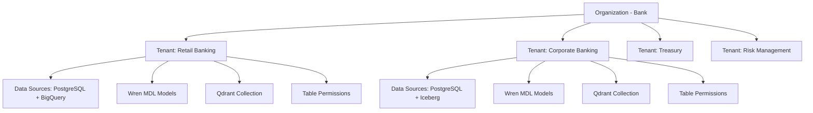
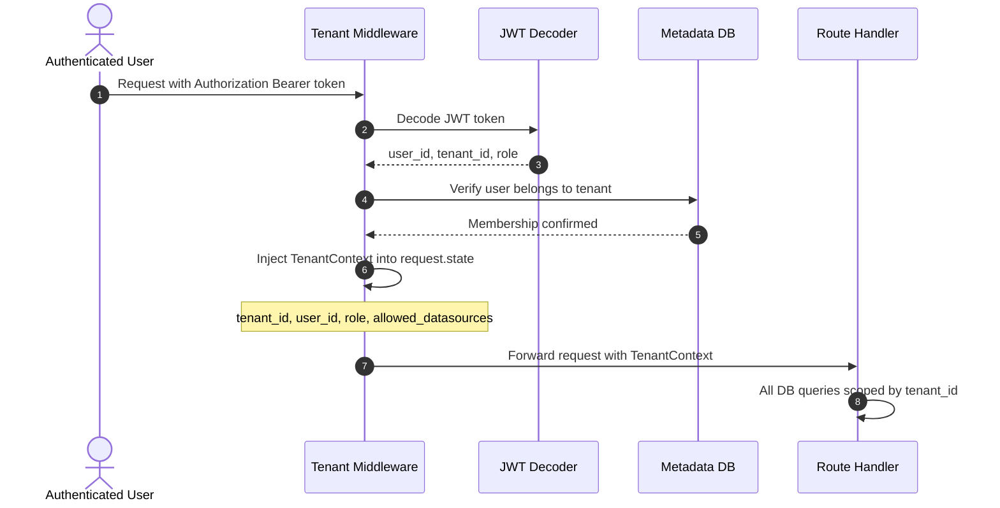
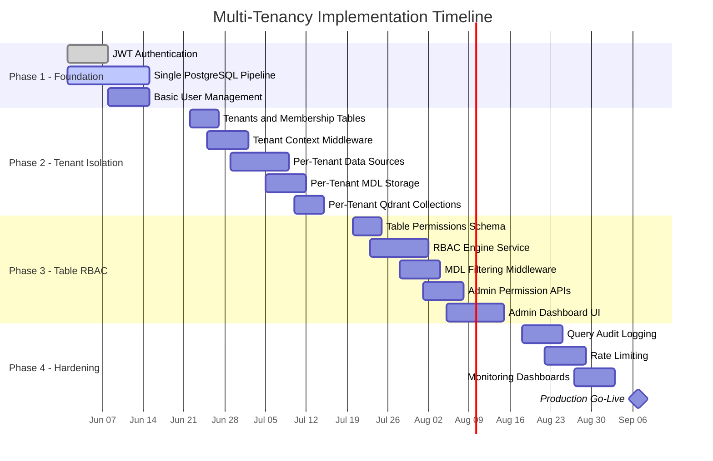

# Multi-Tenancy Implementation Roadmap

**Project:** Semantic Analytics Platform — Tenant Isolation Strategy  
**Version:** 2.0  
**Date:** May 2026  

---

## Executive Summary

This roadmap details the phased implementation of multi-tenancy for the banking semantic analytics platform. The tenant boundary is the **Business Unit** within a bank. Each tenant gets isolated data sources, semantic models, query history, and **table-level access control** per user.

---

## Tenancy Model Overview



---

## Phase 1 — Single-Tenant Foundation (Weeks 1-3)

### Objective
Build a working query pipeline for a single business unit with basic authentication. No tenant isolation yet — this is the baseline.

### Deliverables

| # | Task | Status |
|---|------|--------|
| 1.1 | FastAPI backend with `/api/ask` endpoint | Done |
| 1.2 | Wren Engine integration with MDL compilation | Done |
| 1.3 | Gemini AI Agent with tool-calling pipeline | Done |
| 1.4 | Single PostgreSQL data source via Trino | In Progress |
| 1.5 | JWT-based authentication | To Do |
| 1.6 | Basic user table with email/password login | To Do |

### Database Schema — Phase 1

```sql
-- Minimal auth tables
CREATE TABLE users (
    user_id     UUID PRIMARY KEY DEFAULT gen_random_uuid(),
    email       VARCHAR(255) UNIQUE NOT NULL,
    password_hash VARCHAR(255) NOT NULL,
    name        VARCHAR(255) NOT NULL,
    created_at  TIMESTAMP DEFAULT NOW()
);

CREATE TABLE sessions (
    session_id  UUID PRIMARY KEY DEFAULT gen_random_uuid(),
    user_id     UUID REFERENCES users(user_id),
    jwt_token   TEXT NOT NULL,
    expires_at  TIMESTAMP NOT NULL,
    created_at  TIMESTAMP DEFAULT NOW()
);
```

### API Endpoints — Phase 1

| Endpoint | Method | Description |
|----------|--------|-------------|
| `POST /api/auth/login` | POST | Email/password login, returns JWT |
| `POST /api/ask` | POST | Submit NL query (no tenant scoping) |
| `GET /api/health` | GET | Service health check |

### Acceptance Criteria
- [ ] User can log in and receive a JWT token
- [ ] Authenticated user can ask a natural language question
- [ ] Query executes against PostgreSQL via Wren + Trino
- [ ] Results returned as formatted markdown

---

## Phase 2 — Multi-Tenant Isolation (Weeks 4-7)

### Objective
Introduce the tenant concept. Users belong to tenants. Data sources, MDL models, and Qdrant collections are scoped per tenant.

### Deliverables

| # | Task | Details |
|---|------|---------|
| 2.1 | Create `tenants` table | Stores tenant_id, tenant_name |
| 2.2 | Create `user_tenant_membership` table | Maps users to tenants with roles |
| 2.3 | Tenant context middleware | Extracts tenant_id from JWT, injects into request state |
| 2.4 | Per-tenant data source registration | Each tenant can onboard its own data sources |
| 2.5 | Per-tenant MDL storage | MDL models scoped by tenant_id |
| 2.6 | Per-tenant Qdrant collections | Query cache isolated per tenant |
| 2.7 | Tenant-scoped query execution | Full pipeline respects tenant boundaries |

### Database Migration — Phase 2

```sql
-- New tables
CREATE TABLE tenants (
    tenant_id     VARCHAR(100) PRIMARY KEY,
    tenant_name   VARCHAR(255) NOT NULL,
    org_id        VARCHAR(100) NOT NULL DEFAULT 'default_bank',
    is_active     BOOLEAN DEFAULT TRUE,
    created_at    TIMESTAMP DEFAULT NOW()
);

CREATE TABLE user_tenant_membership (
    user_id     UUID REFERENCES users(user_id),
    tenant_id   VARCHAR(100) REFERENCES tenants(tenant_id),
    role        VARCHAR(50) NOT NULL DEFAULT 'viewer',
    joined_at   TIMESTAMP DEFAULT NOW(),
    PRIMARY KEY (user_id, tenant_id)
);

CREATE TABLE datasources (
    datasource_id   UUID PRIMARY KEY DEFAULT gen_random_uuid(),
    tenant_id       VARCHAR(100) REFERENCES tenants(tenant_id),
    source_type     VARCHAR(50) NOT NULL,  -- 'postgresql', 'bigquery', 'iceberg'
    display_name    VARCHAR(255) NOT NULL,
    connection_config JSONB NOT NULL,      -- encrypted connection details
    trino_catalog   VARCHAR(100) NOT NULL, -- catalog name in Trino
    is_active       BOOLEAN DEFAULT TRUE,
    created_at      TIMESTAMP DEFAULT NOW()
);

CREATE TABLE mdl_models (
    mdl_id      UUID PRIMARY KEY DEFAULT gen_random_uuid(),
    tenant_id   VARCHAR(100) REFERENCES tenants(tenant_id),
    datasource_id UUID REFERENCES datasources(datasource_id),
    model_yaml  TEXT NOT NULL,
    version     INTEGER DEFAULT 1,
    is_active   BOOLEAN DEFAULT TRUE,
    created_at  TIMESTAMP DEFAULT NOW(),
    updated_at  TIMESTAMP DEFAULT NOW()
);

-- Update users table
ALTER TABLE users ADD COLUMN default_tenant_id VARCHAR(100) REFERENCES tenants(tenant_id);
```

### Tenant Context Middleware Flow



### Qdrant Collection Strategy

Each tenant gets its own Qdrant collection to isolate cached query embeddings:

| Tenant | Qdrant Collection | Purpose |
|--------|------------------|---------|
| retail_banking | `queries_retail_banking` | Past query-SQL pairs for similarity |
| corporate_banking | `queries_corporate_banking` | Past query-SQL pairs for similarity |
| treasury | `queries_treasury` | Past query-SQL pairs for similarity |

### API Endpoints — Phase 2

| Endpoint | Method | Description |
|----------|--------|-------------|
| `POST /api/tenants` | POST | Create new tenant — super admin |
| `GET /api/tenants` | GET | List all tenants — super admin |
| `POST /api/tenants/{id}/users` | POST | Add user to tenant |
| `POST /api/datasources` | POST | Onboard data source for current tenant |
| `GET /api/datasources` | GET | List data sources for current tenant |
| `POST /api/datasources/{id}/discover` | POST | Auto-discover schema |
| `PUT /api/datasources/{id}/mdl` | PUT | Save/update MDL models |

### Acceptance Criteria
- [ ] Users can belong to multiple tenants
- [ ] JWT token contains tenant_id claim
- [ ] Data sources are scoped per tenant
- [ ] MDL models are loaded per tenant
- [ ] Qdrant collections are created per tenant
- [ ] User in Tenant A cannot see Tenant B data

---

## Phase 3 — Table-Level RBAC (Weeks 8-11)

### Objective
Within a tenant, different users see different tables. The RBAC engine filters the MDL **before** the AI Agent receives it.

### Deliverables

| # | Task | Details |
|---|------|---------|
| 3.1 | Create `table_permissions` table | Per-user, per-tenant, per-table access |
| 3.2 | RBAC engine service | Loads permissions, filters MDL |
| 3.3 | MDL filtering middleware | Strips unauthorized tables before LLM call |
| 3.4 | Admin API for permission management | Grant/revoke table access |
| 3.5 | Default permission policy | New users get no table access by default |
| 3.6 | Permission audit logging | Track all grant/revoke actions |
| 3.7 | Admin dashboard UI | Visual table permission matrix |

### Database Migration — Phase 3

```sql
CREATE TABLE table_permissions (
    id            SERIAL PRIMARY KEY,
    user_id       UUID REFERENCES users(user_id),
    tenant_id     VARCHAR(100) REFERENCES tenants(tenant_id),
    datasource_id UUID REFERENCES datasources(datasource_id),
    table_name    VARCHAR(255) NOT NULL,
    access        VARCHAR(10) NOT NULL DEFAULT 'READ',
    granted_by    UUID REFERENCES users(user_id),
    granted_at    TIMESTAMP DEFAULT NOW(),
    UNIQUE (user_id, tenant_id, datasource_id, table_name)
);

CREATE TABLE permission_audit_log (
    id          SERIAL PRIMARY KEY,
    action      VARCHAR(20) NOT NULL,  -- 'GRANT', 'REVOKE'
    user_id     UUID NOT NULL,
    tenant_id   VARCHAR(100) NOT NULL,
    table_name  VARCHAR(255) NOT NULL,
    performed_by UUID NOT NULL,
    performed_at TIMESTAMP DEFAULT NOW()
);
```

### RBAC Enforcement Flow — Detailed

```mermaid
sequenceDiagram
    autonumber
    actor User as Priya - Retail Banking
    participant API as FastAPI
    participant RBAC as RBAC Engine
    participant MDL_Store as MDL Store
    participant Agent as Gemini Agent
    participant Wren as Wren Engine
    participant Trino as Trino

    User->>API: What is total loan default rate

    rect rgb(60, 40, 40)
        Note over API,RBAC: RBAC Enforcement - Before LLM
        API->>RBAC: get_allowed_tables for user=priya, tenant=retail_banking
        RBAC->>RBAC: Query table_permissions table
        RBAC-->>API: Allowed tables = loans, customers, branches
    end

    rect rgb(40, 60, 40)
        Note over API,MDL_Store: MDL Filtering
        API->>MDL_Store: Load full MDL for retail_banking
        MDL_Store-->>API: Full MDL with 5 models
        API->>API: Filter MDL - keep only allowed tables
        Note over API: Filtered MDL has 3 models - loans, customers, branches
        Note over API: employee_salary and internal_audit REMOVED
    end

    rect rgb(40, 40, 60)
        Note over Agent,Trino: Query Execution with Filtered Context
        API->>Agent: NL query + filtered MDL with 3 tables only
        Agent->>Wren: Semantic SQL using only visible tables
        Wren-->>Agent: Compiled Trino SQL
        Agent->>Trino: Execute query
        Trino-->>Agent: Results
        Agent-->>API: Formatted answer
    end

    API-->>User: Response based only on authorized data
```



### Default Access Policy

| Scenario | Behavior |
|----------|----------|
| New user added to tenant | **No table access** by default — explicit grant required |
| Admin grants READ on table | User can query that table via NL |
| Admin revokes table access | Table disappears from user's MDL immediately |
| User asks about denied table | Agent says "I don't have information about that" |
| Admin role | Can see all tables within their tenant |

### API Endpoints — Phase 3

| Endpoint | Method | Description |
|----------|--------|-------------|
| `GET /api/rbac/permissions` | GET | List current user's table permissions |
| `GET /api/rbac/permissions/{user_id}` | GET | List another user's permissions — admin only |
| `POST /api/rbac/permissions` | POST | Grant table access — admin only |
| `DELETE /api/rbac/permissions/{id}` | DELETE | Revoke table access — admin only |
| `GET /api/rbac/audit` | GET | View permission change history — admin only |
| `GET /api/rbac/matrix` | GET | Full user-table permission matrix — admin only |

### Acceptance Criteria
- [ ] Admin can grant/revoke table access per user
- [ ] User only sees tables they have READ access to
- [ ] LLM never receives unauthorized table schemas
- [ ] Querying a denied table returns "no access" response
- [ ] All permission changes are audit-logged
- [ ] Admin dashboard shows permission matrix

---

## Phase 4 — Production Hardening (Weeks 12-15)

### Objective
Production-grade observability, performance, and operational tooling for multi-tenant deployment.

### Deliverables

| # | Task | Details |
|---|------|---------|
| 4.1 | Query audit logging | Full trail: user, tenant, query, SQL, tables accessed, row count |
| 4.2 | Tenant usage metrics | Track queries per tenant, cost attribution |
| 4.3 | Rate limiting per tenant | Prevent single tenant from consuming all resources |
| 4.4 | Tenant onboarding automation | CLI/API to create tenant with all resources |
| 4.5 | Monitoring dashboards | Grafana dashboards per tenant |
| 4.6 | Backup and recovery | Tenant-level MDL and permission backup |
| 4.7 | Multi-org readiness | Add org_id scoping for future multi-bank support |

### Query Audit Schema

```sql
CREATE TABLE query_audit_log (
    id            SERIAL PRIMARY KEY,
    user_id       UUID NOT NULL,
    tenant_id     VARCHAR(100) NOT NULL,
    nl_query      TEXT NOT NULL,
    generated_sql TEXT,
    tables_accessed TEXT[],       -- array of table names
    datasources_used TEXT[],     -- array of datasource IDs
    row_count     INTEGER,
    execution_ms  INTEGER,
    status        VARCHAR(20),   -- 'success', 'error', 'denied'
    error_message TEXT,
    created_at    TIMESTAMP DEFAULT NOW()
);

CREATE INDEX idx_audit_tenant ON query_audit_log(tenant_id, created_at);
CREATE INDEX idx_audit_user ON query_audit_log(user_id, created_at);
```

### Rate Limiting Strategy

| Tenant Tier | Queries per Hour | Concurrent Queries | Max Result Rows |
|-------------|-----------------|-------------------|----------------|
| Standard | 100 | 5 | 10,000 |
| Premium | 500 | 20 | 100,000 |
| Enterprise | Unlimited | 50 | 1,000,000 |

### Acceptance Criteria
- [ ] Every query is audit-logged with all metadata
- [ ] Per-tenant usage metrics visible in Grafana
- [ ] Rate limiting prevents tenant resource abuse
- [ ] New tenant can be onboarded via single API call
- [ ] Tenant MDL and permissions can be backed up/restored

---

## Summary Timeline



---

> Each phase has clear acceptance criteria that must be verified before moving to the next phase. No phase should be started until the previous phase passes all criteria.
