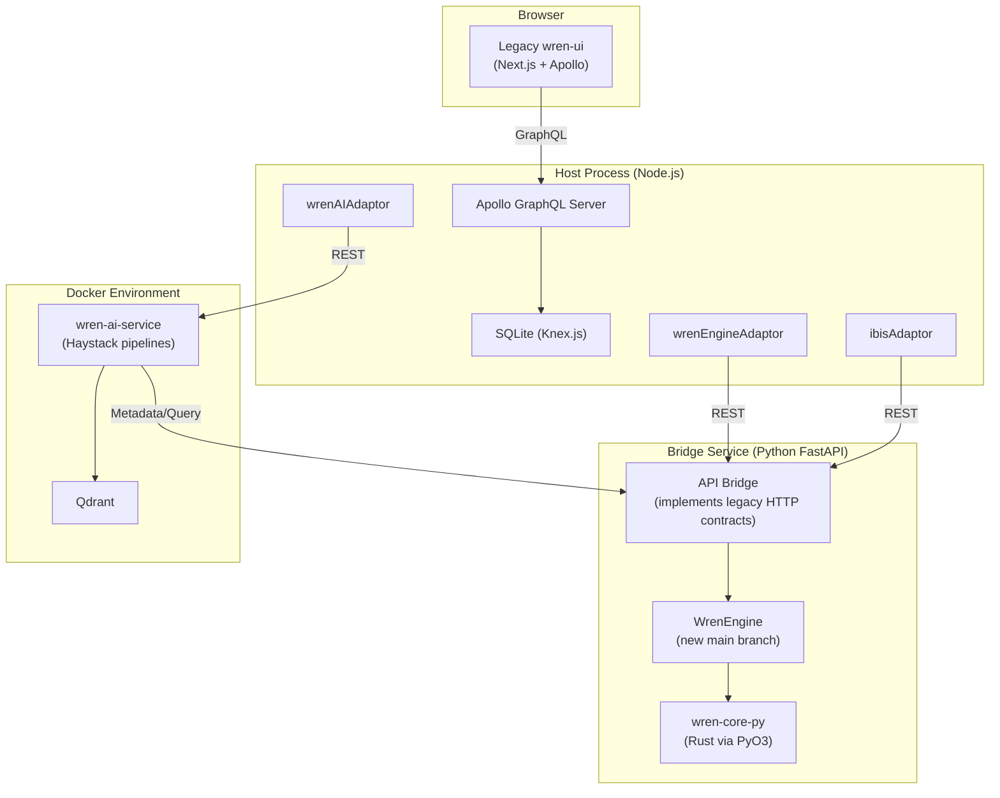

# Wren Engine Bridge

This FastAPI service acts as a compatibility layer that bridges the legacy **Wren UI** and **Wren AI Service** (from `legacy/v1` branch) with the new **Wren Engine** (from `main` branch).

## Overview

The legacy Wren UI and AI Service communicate with backend engines using specific REST API contracts. The new `main` branch rewritten in Rust (`wren-core`) exposes Python bindings and a new SDK interface.

The Bridge service maps these API endpoints:
- Exposes `Wren Engine` endpoints (`/v1/mdl/preview`, `/v1/mdl/dry-plan`, `/v1/mdl/dry-run`, `/v1/mdl/validate/*`, `/v1/data-source/duckdb/*`) using `wrenai` package.
- Exposes `Ibis Server` endpoints (`/v2/connector/*/query`, `/v2/ibis/*/metadata/tables`, etc.) using the new python connectors in `wrenai`.

This allows you to run the new, faster Rust-powered query translator while preserving the full visual UI, NL→SQL "Asking", chart generation, and relationship recommendation capabilities.

---

## Setup & Run Instructions

### Prerequisites
- Python 3.11+
- Node.js v18+ & Yarn v4
- Docker & Docker Compose

### 1. Environment Setup

Copy and configure the environment variables:
```bash
# In the root of the project
cp .env.hybrid .env
```
Open `.env` and fill in your LLM API Key:
```ini
OPENAI_API_KEY=your-openai-api-key-here
```

### 2. Running the Hybrid System

We have created an automated startup script `scripts/run-hybrid.sh` that launches everything:

```bash
./scripts/run-hybrid.sh
```

This script:
1. Loads `.env.hybrid` environment variables.
2. Starts **Qdrant** and the **AI Service** in Docker (detached mode).
3. Launches the **FastAPI Bridge** locally on port `8080`.
4. Starts the **Next.js UI** locally on port `3000` (`yarn dev`).
5. Sets up a process trap to cleanly terminate all processes and Docker containers when you press `Ctrl+C`.

---

## Architecture Diagram


